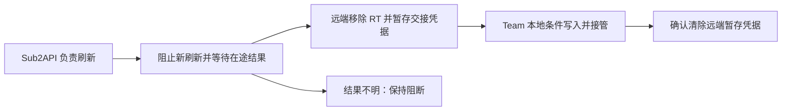

# 第五批：持久化刷新协调与安全交回 Team

已完成本地实现和隔离验证，未部署、未提交或推送。自动轮转、生产 canary、真实上游与完整发布验收属于第六批。

## 本批操作

账号详情 Sub2API 面板增加“安全交回 Team”。需要先有第三批的远端刷新归属。

1. 预览只核对身份、绑定、实例、本地凭据指纹、远端版本和归属 epoch。
2. 确认后先保存本地交接编号，再请求 Sub2API 阻止该刷新链的新刷新。
3. 在途刷新存在时返回等待。点击“继续交回 Team”复用同一交接；超时和重启不代表在途请求已结束。
4. 在途结果已落定后，Sub2API 在同一事务中移除相关账号副本的 RT、推进版本、记录 outbox，并把最后确定的 AT/RT 暂存供 Team 后台接收。
5. Team 再次核对本地完整凭据、绑定、归属、刷新租约及活动 OAuth 会话，原子保存加密 AT/RT 和 Team 归属。
6. Team 确认接收后请求清除 Sub2API 的交接暂存凭据。收尾失败显示部分完成，“确认交接收尾”只重试清理，不重新读取或刷新令牌。

确认会用远端最后确定的凭据替换本地凭据，界面明确说明这一点。预览或取消不会领取 RT。任何 AT/RT 都不进入浏览器响应或本地操作元数据。

人工运行暂停、auth_state、限流和其他错误保持原样。归属已交回不等于授权或生成能力已验证，也不会开启原本关闭的自动任务。



## 刷新协调和旧结果隔离

Sub2API 新增迁移 `250_openai_refresh_fencing.sql`：

- `openai_refresh_grants`：刷新链、归属、epoch、在途票据和结果不明标记。
- `openai_refresh_tokens`：RT 哈希及已观察到的轮换关系，不保存 RT 明文。
- `openai_refresh_handoffs`：交接编号、管理员作用域、身份、阶段和临时凭据托管。托管与原 accounts.credentials 使用同一数据库保护边界，ack 后删除托管内容。
- `openai_refresh_delegated_accounts` 与数据库触发器：交回后的账号只接受 AT；普通 PUT、导入或同步不能重新写入 RT，使远端恢复自动刷新。

实际 RT 刷新前必须取得数据库票据。原生定时刷新、请求恢复、管理员单个/批量刷新和裸 RT 刷新使用同一边界；导入的新账号刷新也进入 RT 账本，已有账号不能通过原始刷新方法绕过协调。Redis 不可用时，OpenAI 仍须通过 PostgreSQL 票据，不能降级成无协调刷新。

成功响应以完整原凭据 CAS 和有效票据写回，版本单调推进，并同事务发布 outbox。并发新授权胜出时，旧刷新响应不会覆盖它；旧 RT 消费事实仍记录，避免重用已消费令牌。取消后的晚回复、无效票据和结果不明的尝试不能落库。

票据不会因 TTL 到期被其他副本抢占。上游失败、取消或本地持久化结果不明时保留阻断，需要核对或新授权，不能仅删除票据、延长时间或重试旧 RT 来推断成功。

Team 本地刷新也强化了完整凭据 CAS 与租约持有者检查。尚有 token 的旧租约不会因过期自动重抢；传输或处理结果不明时保留租约，阻止再次消费同一 RT。已有凭据字段即使没有推进 revision，其变化仍会击败旧刷新结果。

## 协调范围

范围标签为 `observed_rt_lineage`：同一 RT，以及本系统成功刷新时记录下来的新旧 RT 关系。相同 RT 的不同账号副本共享协调。

不能从不透明 RT 或邮箱、工作区、JWT 解码结果推断所有外部授权族。系统外直接调用上游、未升级的旧进程，以及没有被记录的外部令牌复制，不能因此宣称受到完整全局单写保护。因此通用 `single_writer` 仍为 false，新增 `refresh_fencing` 和 `refresh_handoff` 声明上述明确能力。

交回时，当前已知刷新链的账号副本都会移除 RT。Team 后续正常凭据同步仅发送 AT/client_id/到期信息，省略 RT、ID token 和会话凭据。交回后的账号不能通过普通配置推送再次委托远端；再次委托需要另一个明确的受控协议，当前按钮不会绕过此限制。

## 接口与持久化

Team 管理员接口：

```text
POST /api/accounts/{id}/sub2api/refresh-return/preview
POST /api/accounts/{id}/sub2api/refresh-return
```

新操作使用预览 preconditions；已有操作使用 operation_id 继续。新增 SQLite 表 `sub2api_refresh_handoffs`，通过既有启动建表加载，保存脱敏请求、状态、原凭据指纹和归属 epoch，不保存令牌。

Sub2API 管理员 API Key 专用接口，拒绝浏览器 JWT：

```text
POST /api/v1/admin/accounts/{id}/credential-refresh-handoff
```

动作 prepare/read/ack；每次携带相同 operation_id、expected_instance_id、expected_credential_version、expected_updated_at 和 expected_identity。请求体整体不进入审计，响应 no-store；只有 read 在已就绪、作用域与身份匹配时向 Team 后台返回必要的 AT/RT/client_id。

能力 revision=5，请求主合同仍为 contract_version=1。Team 的普通同步兼容 revision 3/4/5，第四批认证恢复兼容 4/5；安全交回要求 revision 5、refresh_fencing、refresh_handoff 和正确范围声明。

## 发布和回退

先发布兼容 revision 5 的 Team，再按 VPS 固定双实例滚动步骤升级 Sub2API，并应用迁移 250。**全部会消费 RT 的进程/副本升级前，不得启用交回操作。** 新副本的能力声明不能证明旧副本已排空；这是正式发布与第六批验收的必要前置条件。

迁移本身新增表、索引和保护触发器，不批量移交现有账号；RT 关系在受控刷新/交接时登记。数据库不可用会阻止新的 OpenAI 刷新，不会授权无锁降级。

交回开始后，不得通过删除归属行、清掉结果不明的票据、回灌 RT 或回退不识别归属的旧 Team 来恢复刷新。旧 Sub2API 进程可能绕过新协议，因此发生交接后不允许未经核对直接回滚到旧刷新代码。保留新表、保护触发器和审计；应用镜像回退不撤销已经发生的上游 RT 消费或所有权交接。

托管未确认时保留供同一交接安全重试，不能把网络失败当作未发送，也不能自动把归属回拨给远端。清理未确认与授权不可用分别呈现。

## 验证记录

- 118 项 Python 回归通过：持久化归属、同一交接跨会话继续、在途/不明租约、读取期间本地变化、后续不回送 RT、收尾失败只重试 ack、旧版本写入和前四批相关功能。
- 28 项 JavaScript 轮询和管理视图回归通过。
- Chromium + 隔离 FastAPI/SQLite：鉴权、预览取消、排空/继续同一操作、Team 接管、保留暂停和认证状态、秘密不进入浏览器响应、1440/390 布局和关闭抽屉停止轮询通过。
- Go 六个相关包针对性测试/编译通过；额外执行共享 `TestRefreshIfNeeded`、新增票据/取消测试和交接审计测试。
- PostgreSQL 18.1 + Redis 8.4 隔离集成共 14 项通过：含新票据/轮换/CAS、排空、拒绝旧票据和 RT 回灌、托管读取及 ack、outbox 故障完整回滚，以及前两批/第四批的恢复回归。
- 两仓 diff 检查通过。Python 仍有既有 curl_cffi 关闭事件循环的忽略异常与 Starlette/httpx 弃用告警；断言通过。

所有令牌与上游响应均为合成数据。未执行生产迁移、真实上游刷新/生成请求、全仓库完整测试或生产发布。
