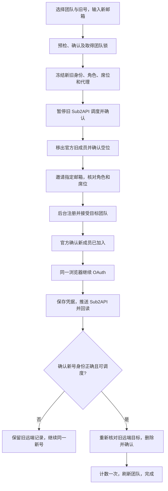

# 轮转改造方案

> 本文记录本次项目审查结果、用户已确认的目标，以及后续实施方案。
> 第 1–12 节保留原始审查和设计记录，其中“尚未实现/未部署”和空验收框描述的是原审查基线。当前实施、验收及限制见第 13 节；离线通过不等于已验证真实账号的一整轮轮转。
> 审查基线：本地工作区，Git HEAD `7907ef7`，包含尚未提交的注册插件更新；公开插件源码及 `dist/chatgpt-signup` 均为 `0.5.9`。

## 1. 已确认的目标

将当前 `dist` 中注册插件的能力接入 48 Team Manager 自带的邀请、踢人、注册和授权流程，先完成**后台内置的手动一键轮转**。

用户在团队管理中选定要替换的旧账号，输入新邮箱，确认一次。之后由项目后台完成整条流程，不要求本机插件保持运行。

| 决策 | 用户已确认的要求 |
| --- | --- |
| 执行位置 | 项目后台内置，注册和授权浏览器由服务器运行 |
| 首期入口 | 先做好手动一键轮转 |
| 新账号来源 | 手动输入邮箱即可；自动获取新邮箱等能力之后再加 |
| 角色和席位 | 继承旧账号的官方角色及 Standard / Premium 席位 |
| 完成范围 | 注册、入组、OAuth 授权、Sub2API 推送和切换计数 |
| 手机验证 | 停止并标记待处理，保留同一邮箱和已完成进度 |
| 旧号下架 | **完全确认新号推送成功之后，才从 Sub2API 删除旧号** |

特别区分两种“删除”：旧号要先从官方团队移出，给新号腾位置；旧号的 **Sub2API 记录要保留到新号可用后再删除**。

以下是本方案采用的实现约定，并非额外宣称用户已逐项确认：

- 踢旧号前先暂停其 Sub2API 调度并核对结果；暂停不等于删除。
- 旧号的本地账号档案、历史记录和凭据保留，仅更新团队成员关系及远端绑定状态。
- 新号可用、旧远端账号删除确认后，整轮才标为成功并计数一次。
- 首期遇到手机验证、人机验证或身份不明，结束当前浏览器执行并保留待处理记录；不建设远程桌面接管界面。
- 保留原独立插件的使用方式；本期不扩展插件的踢人或邀请权限。

## 2. `dist` 的真实用途及改造位置

`dist` 是本地构建产物目录，不是网站前端源码目录。

| 路径 | 当前用途 | 改造时如何使用 |
| --- | --- | --- |
| `dist/chatgpt-signup/` | 可直接加载的自用注册扩展 | 对照行为、核对打包结果 |
| `dist/team48-chatgpt-signup-0.5.9-personal.zip` | 自用扩展压缩包 | 保留为插件交付产物 |
| `dist` 中其他 PNG / JSON | 历史截图、检查或部署记录 | 不参与轮转运行 |
| `extensions/chatgpt-signup/` | 插件真正的源码 | 共享注册能力的修改来源 |
| `scripts/build_signup_extension.py` | 从源码生成 ZIP / 解包目录 | 修改源码后再生成产物 |
| `app/integrations/openai/browser/` | 服务器浏览器执行、注册桥接和授权 | 后台内置改造的主要落点 |
| `app/application/` | 邀请、踢人、轮转、身份核对和推送编排 | 串联完整业务流程 |
| `app/web/` | 管理后台页面及接口 | 提供轮转入口、进度及续接操作 |

本次逐字节核对了两份目录中的 `manifest.json`、`background.js`、`content.js`、`shared.mjs`、`popup.js`、`popup.html`、`popup.css`、`README.md`、`cloudflare.mjs`，均一致。

`dist/` 被 Git 忽略。实现应修改源码，再由构建脚本生成插件产物，不能只改 `dist`。自用配置 `private-config.mjs` 不作为共享源码或部署资源；本次没有读取其中的密钥。

## 3. 已有能力与实际调用关系

### 3.1 项目已经有的能力

- FastAPI + SQLAlchemy + SQLite，任务及步骤持久化到 `operations` / `operation_steps`。
- 官方团队成员与邀请读取、发邀请、撤销邀请、移出成员、离组后确认。
- 本地账号档案、成员关系、备用账号、身份冲突检查及主控母号保护。
- Cloudflare 验证码邮箱、HME 领取与标签、代理冻结、号码池。
- 项目托管注册、注册和 OAuth 共用同一浏览器及页面。
- Sub2API 绑定验证、账号推送、状态回读、调度暂停和删除。
- 自动轮转的前置检查、官方角色/席位继承、推送后可用性核对。
- 团队页和任务页的阶段进度、失败结果、取消与部分任务恢复入口。

本期以复用这些能力为主，不需要另建一套团队管理、邮件服务或任务平台。

### 3.2 当前各条链路不是同一条完整流程

| 入口 | 当前源码行为 | 与本次目标的差距 |
| --- | --- | --- |
| 独立插件 | 输入邮箱 → 注册 → 识别/选团队 → 同步已加入成员 → OAuth → 推送 → 计数 | 邀请仍需人工发送；不负责踢人；浏览器在本机 |
| `/onboard` | 官方邀请 → 注册/复用登录 → 入组确认 → 同浏览器 OAuth | 不包含移出旧号；结束时没有自动完成 Sub2API 推送闭环 |
| `/replenish` | 自动选/领一个邮箱 → 邀请注册 → 入组 → OAuth | 不符合本期必须手填邮箱的入口；返回 `pushed=False` |
| 手动 `/rotate` | 受控轮转 → 暂停旧远端调度 → 踢人 → `onboard.refill` | 默认未开启 `oauth_signup`，没有自动推送和计数，也没有正确继承席位 |
| 后台自动轮转 | 前置检查 → 确认触发条件 → 暂停/踢旧/下架 → 补位注册 OAuth → 推送并回读 | 有可复用能力，但自动选邮箱、号码池、旧号删除时机等与本期要求不同 |

主要调用关系：

```text
POST /api/workspaces/{id}/rotate
  → console_actions.start_controlled_rotate
  → RotateService.run_rotate_saga
  → RotateService.kick_and_refill
  → OnboardService.refill
  → OnboardService.invite_and_onboard
```

注册和授权的现有完整接入点是 `invite_and_onboard(..., oauth_signup=True)`。它会先检查官方邀请，确认注册后的成员角色与席位，再通过 `InvitedBrowserSession` 在同一浏览器中继续 OAuth。

## 4. 本次审查发现的关键改造项

以下是本地源码审查结论。除后文列出的离线测试外，不将它们描述为已在生产环境复现。

### 4.1 手动轮转界面与后端承诺不一致

`app/web/static/js/app.js` 的 `renderTeamRotationControls` 确认框写着“补位账号继承原角色和席位”。但 `RotateRequest` 默认 `role="owner"`，没有 `seat_intent`；`start_controlled_rotate` 也未读取旧成员的角色和席位。

**改造要求：**后端实时读取旧成员，冻结准确的角色和席位，并贯穿邀请与入组后的核对。不能仅修改前端文案或继续依赖默认 Owner。

### 4.2 手动轮转尚未接完整授权推送

`OnboardService.refill` 的 `oauth_signup` 默认是 `False`。现有手动轮转没有像自动轮转的 `refill_and_publish` 那样提供开启 OAuth 的补位函数。

**改造要求：**手动轮转明确走邀请注册与 OAuth 的完整链路，再执行推送回读、旧号删除和计数。注册成功、加入团队、OAuth 成功、远端可用必须分别记录。

### 4.3 原旧号删除策略不满足新要求

`app/domain/rotate.py` 的 `UNBIND_SUB2API_REASONS` 包含 `weekly_limit`、`deactivated`、`unauthorized`。`kick_to_standby` 会根据这些原因提前删除旧 Sub2API 账号，即使调用者传入 `unbind_sub2api=False`，原因本身仍可触发删除。

**改造要求：**为新手动流程显式区分“暂停旧号”和“删除旧号”。旧号删除必须成为新号可用性确认之后的独立步骤，不能靠更换 `reason` 字符串间接控制。旧号删除不再是踢人子流程隐含的副作用。

### 4.4 新旧账号 ID 需要拆开

`start_controlled_rotate` 把被踢账号的 ID 作为 `child_id` 传入后续补位。`pick_replacement` 又优先处理 `child_id`，早于 `email_line` 和 `skip_email`。

沿当前调用路径，空邮箱可能回选刚移出的旧账号；手填邮箱虽然在 `refill` 中优先成为邀请文本，仍可能混入旧账号的代理等补位上下文。

**改造要求：**明确使用 `old_account_id`、`replacement_account_id` 和 `replacement_email`。本期新邮箱必填，新旧邮箱不得相同；旧账号 ID 不得传给补位候选选择器。

### 4.5 手动入口需要数据库锁和踢人前预检

`start_controlled_rotate` 目前主要是先查活跃任务，再用普通 `operation_store.create` 建任务。项目已经有带数据库唯一索引保护的 `create_workspace_locked`，但此入口没有使用。

同时，自动轮转的 `preflight` 检查了浏览器、邮箱、HME、Sub2API 和旧席位，手动轮转没有同等完整的检查顺序。

**改造要求：**手动入口使用原子团队锁，并在暂停/踢人前验证资源和目标邮箱。借用自动轮转的检查内容时，去掉本期不需要的 HME 必配条件，保留 Sub2API 和邮箱等必要条件。

### 4.6 托管模式没有完整获得插件 0.5.9 的能力

已有 `BROWSER_SIGNUP_FLOW=extension`，通过 `signup.py` 的隔离桥接加载共享 `content.js`。当前默认仍是 `legacy`。

但服务器只共享页面脚本，没有运行扩展的 `background.js`。目前存在以下差别：

| 能力 | 独立插件 | 当前服务器托管模式 |
| --- | --- | --- |
| 浏览器输入 | `chrome.debugger` 驱动 CDP，连接失败时有兼容路径 | `SignupState` 没有实现 `input-ready` / 输入指令，页面落到合成事件路径 |
| 暂停后恢复 | 后台状态保存、手工继续、部分原因自动继续/重试 | `fail()` 变为 paused 后，托管循环退出并关闭桥接 |
| Continue 补点 | 0.5.9 后台有更新后的次数与停滞恢复规则 | `signup_state.py` 仍有旧的次数上限及结果阻断规则 |
| 诊断信息 | 暂停原因代码、控件等待几何信息、自动重试事件 | 托管端仅接受部分事件，未完整对齐新协议 |
| 资料生成 | 插件后台生成 | Python 单独生成并保存在账号档案目录 |
| OAuth 页面驱动 | 插件在同一标签页驱动 | 项目原 OAuth 浏览器实现驱动 |

**改造要求：**不能把“加载了同一个 `content.js`”当作“服务器已经复刻了整个 0.5.9 插件”。需要明确实现后台输入适配、消息协议及恢复规则，并单独验证。

### 4.7 手机验证暂停不等于浏览器现场可继续

`SignupState.fail()`、`run_managed_signup` 和 `InvitedBrowserSession.close()` 的现有组合，会在错误返回后结束浏览器执行。任务记录可以保留，浏览器现场不会因此一直保留。

**改造要求：**本期按用户选择保留待处理任务，支持核对后继续同一账号；不能写“点继续即可回到原窗口”。远程浏览器接管及长时间保活属于后续能力。

### 4.8 新号邮箱和任务恢复上下文持久化不足

手动轮转的 `input_payload` 没有完整保存补位邮箱等流程上下文，主要依赖内存闭包传参。通用重试接口又明确禁止对 `rotate` 等危险任务从头重放。

此外，开启 `oauth_signup=True` 后，`onboard.py` 会把同一 Operation 的 `email/account_id` 改成新账号。直接接入会让父轮转原来的旧号身份被覆盖。

**改造要求：**在踢人之前持久化新旧双方身份及流程版本；父任务保留固定的轮转身份，新账号记录放在专用上下文或子步骤中。不能把一个 `account_id` 同时当作旧号、新号和恢复目标。

### 4.9 手填邮箱不应触发领号、HME 必配或自动打标

现有 `maybe_claim_alias` 对已填邮箱直接返回，不领取别名；已有 HME 文档也说明手填邮箱不会自动打标。

**改造要求：**首期直接使用手填邮箱，不选择备用池、不领新 HME、不写 Apple。需要已有可用的邮件转发/验证码读取配置；“只输入邮箱”不等于支持任意无法收信的邮箱。

### 4.10 现有计数去重不等于每轮去重

`member_handoff.count_switch_once` 通过成员关系的 `switch_counted_at` 去重。现有离组和重新加入逻辑没有自动清空这个字段，所以它不能直接表达“同一账号今后再次参加另一轮，也算新的一次轮转”。

**改造要求：**新流程以本轮根任务为计数去重键，事务中同时写计数和已计数标记。普通授权、插件接入和轮转续接不能对同一轮重复加一。仍沿用北京时间按天显示计数的规则。

### 4.11 手动任务不能直接依赖自动轮转的推送重试器

`automatic_rotation.retry_pending_publish` 只选择 `source="auto"` 的任务，并受自动轮转总开关及范围控制。

**改造要求：**手动轮转的失败续接独立于自动轮转开关；只继续推送或清理旧号等未完成步骤，不能为了重试手动任务去打开自动轮转。

### 4.12 当前工作区还有单独的构建障碍

`legacy_import` 源文件在当前工作区已删除，但 `deploy/Dockerfile` 仍有 `COPY legacy_import /app/legacy_import`；README 仍保留相关说明。

**处理方式：**记录为上线前需要核对的既有构建问题，不在本次文档任务中恢复或删除其他人的文件。本次未运行 Docker 构建，不能声称当前工作区可以直接构建部署。

## 5. 目标主流程



### 5.1 用户实际操作

1. 在团队中选择旧成员。可从成员操作直接带入，已有选择器保留。
2. 输入新邮箱。首期不需要再输入密码、角色、席位或重复选择团队。
3. 系统展示旧号、新邮箱、继承的角色/席位及操作后果，用户确认一次。
4. 返回任务 ID，后台执行，团队页和任务页显示同一份真实进度。
5. 成功后显示旧号 → 新号、授权结果、新 Sub2API 账号状态、旧远端删除结果及计数。
6. 遇到异常时显示已经完成的步骤、保留的账号和下一项可执行操作。

当前“补位邮箱 / 原文（选填）”“留空则从待命池选”需要改为必填邮箱。继承规则由后端执行，不能由页面填写的默认角色代替。

### 5.2 踢旧号之前必须确认

- 团队可用，主控母号的凭据和官方成员读取正常。
- 旧号确实是目标团队的已加入成员，且不是主控母号；保留现有最后 Owner 保护。
- 官方旧角色和席位可以明确映射，不依赖本地昵称、邮件后缀或账号套餐推断。
- 新邮箱格式正确，与旧号不同，不是母号，不与其他正在进行的注册任务冲突。
- 新邮箱已有本地档案时，明确它属于本任务续接、可登录旧账号还是身份冲突；不默认再次注册。
- 本地完全没有记录的邮箱，无法在发起网页流程前保证它从未注册过。若网页要求登录已有账号且没有可用凭据，保留同一邮箱并转待处理，不改成另一个新邮箱。
- 浏览器资源和 0.5.9 托管协议适配可用，预定的浏览器执行资源已就绪。
- 邮箱读取配置可用，能读取基础邮件快照。尚未收到验证码不等于配置失败，也不能仅凭配置有效保证特定邮箱已正确转发。
- Sub2API 服务、新号目标分组和推送配置可用。旧远端账号存在时，绑定必须唯一且身份已核对；若可靠地确认没有旧远端账号，记录暂停/删除为跳过，不能把绑定不明当作不存在。
- 没有未解决的同团队轮转。部分完成任务需要继续或核对关闭，不能绕过它再踢另一名成员。

只做一换一时，团队当前已满是正常前提，不能直接复用补位 `prepare()` 的“满员就退出”作为踢人前判断。踢人前核对现状和依赖，踢人后再检查真实空位。

### 5.3 角色与席位继承

| 官方读取值 | 本地意图 / 显示 | 发送邀请时的值 |
| --- | --- | --- |
| `account-owner` / 规范化 `owner` | Owner | `account-owner` |
| `standard-user` / 规范化 `member` | Member | `standard-user` |
| `seat_type=default` | Standard / `standard` | `default` |
| `seat_type=prolite` | Premium / `premium` | `prolite` |

- 本期严格继承时应传入明确 `standard` 或 `premium`，不以 `workspace_default` 替代未知旧席位。
- `admin` 或未知角色不在现有邀请支持范围内，停止并说明原因，不降级为 Member 或升级为 Owner。
- 官方 Owner 子号仍可能是本地 child；主控母号由 `workspace.owner_account_id` 等身份关系判定。
- 发邀请后、入组后和授权完成后的核对，都应与同一份冻结目标一致。
- 邀请已经存在且角色/席位不一致时停止，不偷偷撤销重发或修改计费席位。

### 5.4 “完全确定新号推送成功”的判据

不能仅凭 HTTP 200、OAuth 换票成功或推送返回 `ok` 就删除旧号。至少同时满足：

1. 官方已确认新邮箱在目标团队，角色和席位符合继承值。
2. OAuth state / PKCE / 邮箱校验成功，访问和刷新凭据已保存。
3. 工作空间身份已核对；明显不匹配或无法取得必要身份确认时不放行旧号删除。
4. Sub2API 远端绑定唯一且 verified，对应新邮箱及正确的官方团队上下文。
5. 推送回执确认完成，并通过新的远端读取确认当前账号为 `healthy`、状态未过期且可调度。
6. 回读对应本次凭据版本和 Sub2API 实例，旧快照或已被替换的凭据不能作为依据。
7. 删除旧号前再次检查上述结论仍有效；新旧远端 ID 必须不同。

可复用 `automatic_rotation.publish_replacement` 的回执和新鲜状态核对原则。通用授权后的 `finish_after_authorization` 提供的是较轻的后续处理，不能单独充当删除旧号的判据。

### 5.5 旧号最终删除

- 删除对象从踢人前冻结的旧绑定定位，再核对当前绑定和远端身份。
- 只删除目标旧远端 ID，不按邮箱模糊查找，不误用父任务后来指向的新账号 ID。
- 旧号有其他团队上下文或远端绑定存在冲突时停止，由人工核对范围。
- 删除请求回执不明时先只读核对；超时、401、5xx 或读取失败不能当作“已删除”。
- 取得明确删除回执并核对目标不存在后，才更新本地旧绑定状态。回执丢失时，可依据同一实例对已验证目标的可靠不存在证据收尾，不能把鉴权失败或接口错误误当目标 404。旧账号档案仍保留。
- 删除失败时，新号保留且继续可用，任务显示“新号可用，旧号下架待处理”；只重试旧号核对/清理。
- 整轮中断不会自动把旧号重新邀请回来，也不会删除已经注册的新号。

## 6. 注册能力如何迁入后台

### 6.1 推荐落地方式

继续使用项目的 Python 浏览器 worker、`SignupBridge`、账号档案和代理管理，复用插件页面逻辑，把服务器缺少的宿主能力接完整。

服务器不安装含密钥的自用 ZIP，不调用 `/api/ext/resolve` 猜团队，也不需要插件 Bearer Token。后台已从轮转任务知道唯一目标团队，可直接调用应用服务。

### 6.2 需要补齐的适配

| 部分 | 首期要求 |
| --- | --- |
| 页面脚本 | 以审查时的 0.5.9 公开源码为基线，保留输入、定位、等待及提交防重复行为 |
| CDP 输入 | 给托管宿主实现页面所需的 `input-ready`、键盘、文本插入、鼠标、滚轮、原生日期结构等消息；核对当前任务、文档和来源 |
| 输入结果 | 动作未发出与已发出但回执丢失分别处理，避免重复提交；取消后释放已按下的键，不再启动新动作 |
| 消息协议 | 明确能力及协议版本，不能只比对 manifest 版本；不支持的能力应被明确报告 |
| 等待和重试 | 对齐必要的控件等待、页面前进识别及有界重试；不得把未知外部写入结果当作未提交 |
| 邮件 | Python 宿主读取旧邮件快照和新验证码，按目标邮箱匹配；邮箱管理密钥不进入页面脚本 |
| 账号资料 | 密码、姓名和生日在同一任务及续接期间保持一致；现有服务器持久化档案可复用 |
| 入组交接 | 注册结束后由项目读取官方成员，确认后停止注册脚本，再让同一浏览器页面进入 OAuth |
| 手机验证 | 注册和 OAuth 都停止并标待处理，不取号码池、不发送短信、不换邮箱 |
| 诊断 | 保存固定步骤、原因代码、时间和执行能力，不保存验证码、密码、Cookie、完整回调或网页原文 |

CDP 隔离执行环境与 CDP 输入是两种能力：已有隔离桥接并不说明当前输入由浏览器生成。验收需要检查实际输入结果，不能只看类名中是否有 CDP。

`isTrusted=true` 只表示事件由浏览器生成，不能作为免手机验证或提高注册成功率的保证。也不承诺服务器浏览器与本机 HubStudio 的环境行为完全相同。

### 6.3 开关与兼容

当前 `BROWSER_SIGNUP_FLOW` 是进程级选项，影响所有相关注册入口。首期建议为新手动流程显式选择并冻结注册实现，避免上线这一功能时无意改变其他自动化任务。

需要将选择逐层传递到真正的 worker；只在接口记录 `signup_flow` 而浏览器仍读取全局默认值不算完成。原全局设置继续作为其他入口的默认值，新流程失败不在同一次任务中切换另一套引擎再注册。

## 7. 任务状态、失败与继续

### 7.1 复用 Operation，细化步骤

继续使用项目已有状态：`queued`、`running`、`waiting`、`success`、`partial`、`failed`、`cancelled`、`manual_required`。用户可见步骤建议为：

1. 检查资源与确认双方身份。
2. 暂停旧号调度。
3. 移出旧成员并确认空位。
4. 邀请新邮箱。
5. 注册并加入团队。
6. 完成 OAuth 授权。
7. 推送并确认新号可用。
8. 删除旧 Sub2API 账号。
9. 计数并完成。

沿用现有阶段进度组件，按步骤证据显示完成，不用计时器伪造百分比。需要把现在被压在一个 `refill` 阶段中的注册、授权、推送和旧号清理展开。

### 7.2 失败后的保留与动作

| 中断位置 | 必须保留的事实 | 后续动作 |
| --- | --- | --- |
| 前置检查失败 | 旧号及官方成员保持原状 | 修正配置后重新检查 |
| 旧远端已暂停，尚未踢人 | 旧号仍在团队，暂停结果已记录 | 核对后继续；恢复调度必须确认旧号仍适合使用 |
| 踢人响应不明 | 不宣称旧号已离组 | 先同步官方状态，不再次直接踢人 |
| 已离组但空位不明确 | 旧号离组事实及原席位证据 | 核对空位，默认不强制补位 |
| 邀请已发出 | 新邮箱和邀请状态 | 核对/继续同一邮箱，不再领取其他邮箱 |
| 注册要求手机号或人机验证 | 同一邮箱、档案、已完成注册阶段 | `manual_required`，人工处理后重新核对再继续 |
| 已加入但 OAuth 失败 | 新成员保留，旧远端记录保留 | 只对同一账号继续授权 |
| OAuth 成功但推送不明 | 凭据已保存，写入回执及版本已记录 | 先回读，只补未完成的推送步骤 |
| 新号可用但旧远端删除失败 | 新号维持可用，旧号维持暂停 | 只核对并完成旧号清理 |
| 清理完成但计数未提交 | 所有外部动作结果 | 仅执行幂等计数和收尾 |
| 进程重启或用户取消 | 已确认的所有外部事实 | 转为可核对的待处理，不从头自动重放 |

新号可用之前，旧远端记录始终不能删除。保留旧远端记录不代表旧号还能使用：它可能已经离开官方团队，界面必须如实显示。

### 7.3 继续机制

现有通用 `/api/operations/{id}/retry` 拒绝重试 `rotate`，应保留这个保护。新增针对轮转的继续动作：

- 根据根任务定位原旧号和指定新号，先读取官方及远端状态。
- 只允许接着执行尚未确认完成的阶段。
- 外部动作发出前先记录执行意图；结果不明先核对，避免崩溃窗口内重复发邀请、删除或推送。
- 任务首次创建后，新邮箱和继承配置不能在“继续”时被静默替换。
- OAuth 票据过期后生成新票据，但继续同一账号；旧回调不能再次换票。
- 手机验证导致原 worker 结束后，可使用同账号档案重新进入流程，或使用既有手动授权入口完成授权；需关联原轮转，避免另一次推送/计数。
- 手工注册、邀请接受或授权结果必须再次由官方成员及凭据校验确认，不能只靠用户勾选“已完成”。

## 8. 数据、互斥与计数约定

### 8.1 必须持久化的上下文

首期优先扩展现有任务输入和步骤结果，不另建通用工作流引擎。是否需要专用字段/索引由实现时的查询和事务要求决定。

| 数据 | 用途 |
| --- | --- |
| `flow_version`、`root_operation_id` | 区分新手动流程与历史任务，关联所有续接 |
| `workspace_id`、官方 workspace ID | 固定团队上下文 |
| `old_account_id`、`old_email`、官方成员 ID | 防止移错人和父任务身份被覆盖 |
| `replacement_email`、`replacement_account_id` | 保留指定邮箱及后续生成的本地账号 |
| 继承的 role / seat 和观察时间 | 邀请、入组及续接核对 |
| 旧绑定 ID、旧远端 ID、Sub2API 实例标识 | 最终精准删除旧号 |
| 新绑定 ID、凭据 revision、推送 Operation ID | 确认新号可用和防重复推送 |
| 注册引擎/协议版本、代理档案引用 | 同一身份使用一致执行环境 |
| 阶段执行意图、回执和确认结果 | 处理超时、取消及重启恢复 |
| `switch_counted` 或等价事务标记 | 每个根轮转只计数一次 |

注意现有 `pack_input()` 会脱敏 `email_line`、`phone_line` 等字段，脱敏结果无法拿来恢复任务。应独立保存规范化后的纯 `replacement_email`；密码等凭据走既有加密账号字段，不能靠把完整邮箱原文和凭据写进日志解决恢复问题。

### 8.2 互斥边界

- 同团队的邀请、踢人、轮转和同步等互斥沿用 `create_workspace_locked` 及现有动作集合。
- 新邮箱不能同时被另一任务分配到其他团队；检查目标邮箱活跃任务，并提供对应的并发保护。
- 延续单浏览器执行槽；应在踢人前获得执行机会，避免先踢了多个团队再排队等待注册。
- 浏览器槽的预约与 `InvitedBrowserSession` 内部取锁需要统一所有权：将已取得的执行权交给会话，或重构为一次取锁的入口；不能在父任务持锁时让子会话再次等待同一把非重入锁。
- 团队数据库操作锁不等于长时间保持 SQLite 写事务。网络等待期间提交进度，靠任务租约和心跳维持所有权。
- 终态 `partial/manual_required` 不在当前活跃状态索引内，要另行拦截同团队未解决的新轮转。只归档显示记录不能等同于已核对外部状态。

### 8.3 计数约定

- 本方案在新号可用、旧号清理确认后计本轮一次；清理待处理时显示具体状态。
- 计数标记和团队今日计数必须同事务提交，处理重复请求和提交后响应丢失。
- 复用 `workspace_switch_count` 的北京时间日期归属与跨日逻辑。
- 不能只顺序调用“计数函数”和“标记完成”，中间崩溃会重复计数；现有计数函数内部会 commit，组合时需调整事务边界。
- 轮转中的手工授权续接不独立计数，收尾交回根轮转；与 `switch_counted_at` 的既有插件规则保持兼容。
- 此处“今日切换次数”与自动轮转每日上限是两件事，不修改自动轮转限额的统计规则。

## 9. 接口和模块改动范围

### 9.1 接口建议

以下新增路径和字段是设计建议，尚未实现。

| 接口 | 处理方式 |
| --- | --- |
| 现有 `POST /api/workspaces/{id}/rotate` | 升级为首期手动入口，必填规范化新邮箱；返回 202 和 `operation_id` |
| 建议 `POST /api/workspaces/{id}/rotate/preview` | 只读预检，展示继承的角色/席位及阻塞原因；执行时仍需在锁内重新核对 |
| 现有任务列表/详情/取消 | 复用，补充阶段结果和新旧身份 |
| 建议 `POST /api/operations/{id}/continue-rotation` | 核对事实后继续同一轮未完成部分 |
| 现有 `/onboard`、`/kick`、`/revoke-invite` | 保留独立用途，复用底层服务，不让新流程递归调用自己的 HTTP 接口 |
| 现有 `/api/ext/*` | 不作为后台编排通道，不新增踢人权限 |

请求可沿用 `email` 表示旧号、`email_line` 表示补位输入，但首期要把后者收紧为单个必填邮箱并持久化为 `replacement_email`。如果采用新字段，必须同步前端和接口测试，不能新旧字段互相覆盖。

本期不接收客户端指定的角色/席位覆盖，也不通过客户端 `reason` 决定旧号提前删除。常规入口维持 `force_refill=False`。

### 9.2 具体源码落点

| 模块 | 需要完成的改造 |
| --- | --- |
| `app/web/schemas/resources.py` | 轮转输入校验，新旧邮箱不能相同，新邮箱必填 |
| `app/web/routes/api.py` | 预检、正式提交和继续接口，保持管理员鉴权与 202 任务响应 |
| `app/application/console_actions.py` | 原子锁、持久化双方上下文、传入完整流程；避免旧 ID 用作新候选 |
| `app/application/rotate.py` | 分离暂停、官方离组和最终远端删除，保护其他入口行为 |
| 建议 `app/application/manual_rotation.py` | 集中首期手动编排、成功判据和按阶段继续，避免继续扩大自动轮转条件分支 |
| `app/application/onboard.py`、`invitation_flow.py` | 指定邮箱完整注册/OAuth、明确 role/seat，禁止覆盖父轮转旧号身份 |
| `app/application/automatic_rotation.py` | 提取可共用的推送确认能力；保留自动任务特有的范围、号码池和重试策略 |
| `app/integrations/openai/browser/signup.py`、`signup_state.py`、`signup_bridge.js` | 0.5.9 托管消息及 CDP 输入适配、原因记录、边界处理 |
| `extensions/chatgpt-signup/content.js`、`background.js`、`shared.mjs` | 对照协议，必要时抽出共享定义，保留独立插件行为 |
| `app/application/jobs/browser.py`、`oauth_signup.py` | 单浏览器同页交接、取消、无短信策略和继续时的新票据 |
| `app/application/operations.py` 及模型/迁移 | 新流程版本和上下文、去重/续接必要索引、外部动作意图 |
| `app/application/member_handoff.py`、`workspace_switch_count.py` | 根任务计数去重及手工授权续接的重复计数防护 |
| `app/application/presenters.py`、`app/web/static/js/task-progress.js` | 拆开真实阶段，区分新号可用与旧号清理待完成 |
| `app/web/static/js/app.js`、相关团队视图 | 必填邮箱、继承配置预览、任务继续及最终结果展示 |
| `deploy/Dockerfile`、`.dockerignore` | 仅部署适配所需公开资源，核对现有失效 COPY |

## 10. 实施顺序

### 第一步：修正手动轮转的基础契约

完成新旧身份拆分、必填邮箱、角色席位继承、数据库锁、踢人前预检和可恢复上下文。将旧号删除从踢人子流程中拆出，先用模拟接口证明顺序正确。

验收重点：预检失败不踢人；不回选旧号；同团队并发只能建立一条流程；本期不调用 HME 或号码池。

### 第二步：补齐服务器注册适配

在现有托管结构中对齐 0.5.9 的输入及消息能力，验证注册、接收验证码、接受邀请和同页 OAuth。故障结束时保留同一账号；不承诺保留浏览器现场。

验收重点：服务器真实 Chromium 的模拟页面跑通，不仅是 Python 消息单测通过；旧独立插件回归也要通过。

### 第三步：接通完整收尾和继续

新号推送及回读成功后才执行旧远端删除，加入根轮转计数和按阶段继续机制。

验收重点：推送假成功/超时/错误工作空间时旧号不删除；新号可用后清理失败，只继续清理；任何继续操作均不重复注册或计数。

### 第四步：接入管理界面和部署准备

更新既有轮转表单、确认信息、阶段进度和待处理动作。核对容器资源及构建障碍，再进行隔离环境验证。

真实团队的一轮验证及部署属于后续实施动作，需按当时授权和项目约束执行。本次仅形成文档，没有部署或触发真实邀请、踢人、注册、短信、推送及删除。

### 后续再做

- 自动获取 HME 邮箱和可选的备用账号来源。
- 将验证完成的公共链路接入自动轮转。
- 批量轮转及浏览器并发。
- 号码池策略和远程浏览器人工接管。

## 11. 验收清单

### 11.1 主路径

- [ ] 在团队选择旧号、输入新邮箱，确认一次后后台完成全部步骤。
- [ ] 新号为旧角色 + 旧席位；Owner / Member 与 Standard / Premium 组合均覆盖。
- [ ] 同一运行中的注册和 OAuth 使用同一浏览器、页面及冻结代理。
- [ ] 注册成功、入组成功、授权成功、Sub2API 可用和旧号删除分别有证据。
- [ ] 新号未被确认可用前，旧 Sub2API 记录从未被删除。
- [ ] 旧远端删除确认后仅计数一次，旧本地档案仍保留。

### 11.2 输入、资源和并发

- [ ] 空邮箱、无效邮箱、新旧邮箱相同、母号邮箱、身份冲突均在踢人前被拒绝。
- [ ] 不选择备用池、不领取 HME、不调用短信服务，HME 未配置也不阻塞有效的手填邮箱。
- [ ] 邮箱配置、浏览器、Sub2API 或角色席位不明时，预检停止。
- [ ] 团队满员不妨碍正常的一换一预检，但踢人后必须检查空位。
- [ ] 重复点击和并发请求不造成重复踢人、邀请、注册或重复领取任务。
- [ ] 同邮箱跨团队任务冲突、旧号其他团队上下文和新旧远端 ID 相同都有保护。

### 11.3 中断和外部结果不明

- [ ] 踢人响应丢失后先读取官方状态，不盲目重新 DELETE。
- [ ] 邀请已存在时不重复发送；角色或席位冲突时停止。
- [ ] 手机验证、人机验证和限流保留同一账号；不换邮箱尝试。
- [ ] 已加入但 OAuth 失败，只继续同一账号授权。
- [ ] 推送写入成功但回读不明，只核对或补后续，不重复注册或覆盖凭据。
- [ ] 错误工作空间、陈旧状态、凭据 revision 变化不能触发删除旧号。
- [ ] 旧远端删除超时后先核对是否已删除；清理失败不影响已可用的新号。
- [ ] 清理成功后计数提交/响应失败，可继续且不重复计数。
- [ ] 关闭页面不取消后台任务；服务重启后保留记录并提示核对，不自动重放浏览器。
- [ ] 暂停/取消后不继续输入或发起新的外部动作，已完成步骤不伪装为已回滚。
- [ ] 历史轮转任务不被新继续接口按新流程解释或自动重放。

### 11.4 界面与日志

- [ ] 页面不再承诺未实现的继承行为，不提供空邮箱自动选人作为首期默认。
- [ ] 任务页可明确看到旧号、新号、当前阶段及下一步处理动作。
- [ ] “新号可用、旧号下架待处理”不显示为完整轮转成功。
- [ ] 日志、API 任务详情和诊断不暴露验证码、密码、访问令牌、代理密码或完整回调。

## 12. 本次验证记录与依据

### 12.1 已实际执行

本次执行以下离线 Python 回归，共 **69 项通过**：

```powershell
.\.venv\Scripts\python.exe -m unittest tests.test_rotate tests.test_invitation_flow tests.test_managed_signup tests.test_browser_handoff tests.test_replenish tests.test_workspace_lock_and_pause -q
```

插件当前源码的 Node 回归通过：

```powershell
node --test --test-reporter=dot tests/signup_extension.test.cjs
```

这些检查验证已有实现和相关保护，不证明本文拟议的新流程已经完成。已有测试主要隔离数据库或模拟外部接口；测试通过也不覆盖第 4 节指出的全部手动入口缺口。

此外，已检查 Git 工作区状态、相关源码及已有 diff，并核对上述公开插件文件的源码/产物一致性。

### 12.2 未执行

- 未连接 VPS，未读取生产数据库或验证线上配置是否启用了 `extension`。
- 未执行真实官方邀请、踢人、注册、OAuth 或手机验证。
- 未对真实 Sub2API 账号进行暂停、推送或删除。
- 未启动本次真实浏览器端到端测试，未做全量测试或 Docker 构建。
- 未修改业务代码、已有插件更新或 `legacy_import` 删除状态。

### 12.3 后续回归复用

实施时按改动范围复用 `test_rotate`、`test_invitation_flow`、`test_managed_signup`、`test_browser_handoff`、`test_oauth_signup`、`test_oauth_security`、`test_invite_seat_contract`、`test_async_commands`、`test_member_handoff`、`test_workspace_lock_and_pause`，并补足本方案的顺序与断点用例。

界面和浏览器方面复用 `signup_extension.test.cjs`、`task_progress_ui.test.cjs`、`browser_managed_signup.py`、`browser_signup_handoff.py` 等基础设施，不另搭一套测试框架。

### 12.4 主要参考文件

- [插件源码说明](extensions/chatgpt-signup/README.md)
- [现有托管注册说明](docs/managed-signup.md)
- [现有自动轮转说明](docs/automatic-rotation.md)
- [插件与 Team48 授权衔接](docs/extension-team48-handoff.md)
- [邀请角色和席位契约](docs/contracts/openai-invite.md)
- [HME 联动边界](docs/hme-linkage.md)
- [项目约束](AGENTS.md)

历史文档部分路径和行为已落后于当前源码，例如 HME 文档仍引用旧 `app/services/hme.py`，当前实现为 `app/application/resources/hme.py`；成员生命周期旧说明与当前移出路径的远端暂停行为也有差异。本方案以本次查看的源码和用户本次确认优先。

部署边界继续遵守项目规则：本项目仅在 `/opt/team48`；Sub2API 账号操作只走既有 HTTP API，不修改 `/opt/sub2api`、其容器、Compose、数据库、Redis 或主备 Nginx。

## 13. 本地实现验收（2026-09-28）

本次在原有未提交改动上补齐上线阻塞，保留插件修改及旧导入模块删除，按以下范围验收。真实业务写入未用于测试。

### 13.1 已落实的关键契约

- 指定旧号和单个新邮箱；后端实时读取并冻结官方角色及 Standard / Premium 席位。新增只读预检接口，确认框显示实际继承值；正式执行再次检查。
- 手动流程固定使用 `extension`，不改变其他入口的全局默认。服务器实现 CDP 原生输入、协议 v1 校验、日期控件结构读取和有界 Continue 重试；输入结果不明时停止，不释放已可能提交的动作去盲目重试。
- 在暂停旧远端、踢人之前冻结代理并预约单浏览器槽；注册与 OAuth 在同一运行的浏览器页面交接。手机验证保留原邮箱并结束本次执行，不调用号码池。
- 父任务保持旧号身份，步骤保存新号、凭据版本、推送操作 ID、阶段意图和确认结果。任务目标显示“旧号 → 新号”。
- SQLite 写事务序列化同邮箱跨团队分配及重复继续请求，团队锁仍由既有唯一索引保护。未完成轮转归档后仍占用团队和新邮箱，可从原任务继续。
- 新号完成官方入组、OAuth、推送和健康回读之后，删除前再核对角色、席位、授权工作空间、凭据版本、实例配置、新旧绑定和其他团队上下文。
- 没有本地绑定不能直接当作没有旧远端；必须完整读取远端目录。删除后以完整、已鉴权的目录读取确认目标不存在，详情接口单独返回 404 不视为删除证据。
- 推送操作 ID 在外部写入前落库；中断后按同一 ID 回读和补后续。已可用的新号不因旧号清理失败而重注册；计数和本轮完成标记同事务提交。
- 人工授权/插件后续遇到未完成轮转时，把推送和计数交回根轮转，避免提前或重复计数。其他自动轮转原有行为保留。
- 修复 Docker 对已删除 `legacy_import` 的失效 COPY，同步移除 README 旧导入说明及仅用于该已删除模块的测试。

### 13.2 验证范围

Python 回归覆盖手动/自动轮转、并发锁、邀请席位、OAuth 安全与同页交接、通用任务、人工授权计数、Sub2API 推送及状态、HME 和启动。新增断点用例覆盖归档占用、跨团队抢同一邮箱、双重继续、远端假 404、未绑定旧远端、错误工作空间、角色席位变化、凭据版本变化和推送回执丢失。

真实 Chromium 的离线模拟页面覆盖服务器注册、主页就绪、同页 OAuth 交接、原生输入 `isTrusted`、原生日期结构、停止后不再输入、手机验证停止，以及独立插件注册到 Team48 OAuth 的交接。所有 OpenAI 页面、邮箱和写请求均使用本地测试夹具。

页面回归覆盖深色/浅色、1440/1024/390 宽度、实际角色席位确认、一次提交及错误恢复；页面无脚本错误、轮转表单无横向溢出。Impeccable 单会话自查及机械检测无本次范围的阻塞项。

复用命令：

```powershell
.\.venv\Scripts\python.exe -m unittest tests.test_manual_rotation tests.test_managed_signup tests.test_browser_handoff tests.test_oauth_signup tests.test_oauth_security tests.test_invitation_flow tests.test_invite_seat_contract tests.test_onboard tests.test_rotate tests.test_rotation_scope tests.test_automatic_rotation tests.test_workspace_lock_and_pause tests.test_operations tests.test_async_commands tests.test_batch3_actions tests.test_official_member_logic tests.test_member_handoff tests.test_workspace_switch_count tests.test_sub2api_sync_contract tests.test_sub2api_republish tests.test_sub2api_remote_state tests.test_boot tests.test_no_legacy_runtime tests.test_runtime_status tests.test_workspace_sync tests.test_hme_actions -v
.\.venv\Scripts\python.exe -m unittest tests.browser_managed_signup tests.browser_signup_handoff -v
node --test tests/*.test.cjs
# 启动隔离 tests.preview_app 后：
.\.venv\Scripts\python.exe -m tests.browser_accounts_layout
```

本次结果：267 项针对性 Python 回归中，266 项首次通过，1 项新增测试在事务回滚后读取过期 ORM 对象导致测试断言异常；修正测试后，包含该项的 56 项复跑全部通过。最后调整推送未知结果处理后，手动/自动轮转 50 项再次全部通过。Chromium 注册及插件交接 14 项通过，额外原生输入协议/日期测试 1 项通过，新增插件可见性与点击测试 13 项通过。Node 131 项通过，账号页布局回归通过。Python 编译、JS 语法和 `git diff --check` 通过。

### 13.3 验收边界

通过离线回归只能证明这些受控场景的行为；本次没有指定真实旧号和新邮箱，因此未执行真实邀请、踢人、注册、OAuth 换票、Sub2API 账号推送或删除，不能把第 11 节所有真实主路径标为已实测通过。

待处理任务保留邮箱、档案及步骤，不保留已经关闭的浏览器现场。需要手机验证、人机验证或无法确认写入结果时会停止，人工核对后继续；不承诺无人值守通过所有外部验证。


### 13.4 VPS 部署验收

- 功能提交：`88759ca063f5bc26d7f39d0a376d98d2b9dc9278`，已推送 `origin/main`，VPS 快进拉取后构建。
- 只执行 `docker compose -p team48 -f deploy/docker-compose.yml build team48` 及 `up -d --no-deps team48`；未操作 Sub2API 容器或部署目录。
- 重建前确认没有活跃任务；SQLite 在线备份通过 `PRAGMA integrity_check`。数据库与配置备份存放 `/opt/team48/deploy/releases/rotation-88759ca/`（目录 700、敏感备份文件 600），旧镜像保留为 `team48-manager:rollback-88759ca`。
- 新容器为 `running / healthy`，仍只绑定 `127.0.0.1:8018`。镜像 ID：`sha256:bb644e0a1206952863ffd695b4ef2e212c4866fc46f1ddd26b229f37d8ee1db0`。
- 本机回环 `/health`、`/login`、`/static/js/app.js` 及公网 HTTPS 登录页均为 200。预检和继续轮转接口存在。
- 容器内 `manual_rotation_v1` 使用 `extension`，公开注册资源版本 `0.5.9`。按服务器实际配置启动 Chromium（`headless=false`），将全部页面请求拦截为本地模拟表单，确认输入事件 `isTrusted=true`，停止桥接后不再输入。
- 容器与 VPS 工作副本中的 `manual_rotation.py` SHA-256 一致：`a775baf981fedf13d65c4e49e47ca2228fb7d8175d54fcb8f4236de6e7b77f65`。

结论：本地离线验收、容器重建和部署后检查通过；真实账号整轮业务验证仍属于 13.3 节所列未验证范围。
